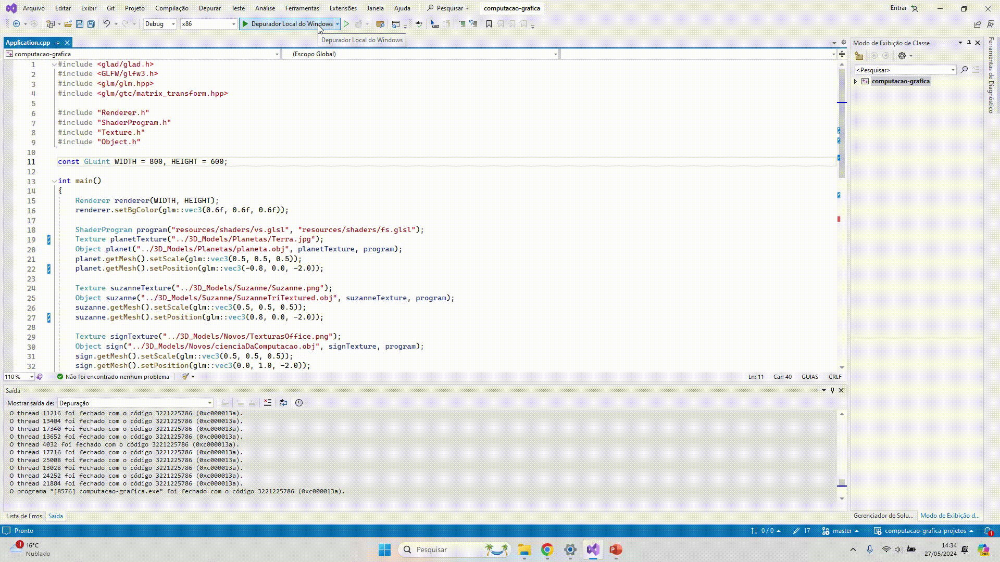

# Resultados Tarefas
## Tarefa 1 - [M1 - Tarefa](M1%20-%20Tarefa)
Setup do ambiente para utilizar OpenGL com Visual Studio

## Tarefa 2 - [M2 - Tarefa](M2%20-%20Tarefa)
Adicionadas funcionalidades de rotate, translate e mudança de tamanho nos cubos

## Tarefa 3 - [M3 - Tarefa](M3%20-%20Tarefa)
Carregando modelo 3d de arquivo .obj

## Tarefa 4 - [M4 - Tarefa](M4%20-%20Tarefa)
Recuperadas as informações do arquivo .obj, inclusive vetores normais, sendo acrescentado ao layout. Também foram recuperados os coeficientes de iluminação do arquivo .mtl para uso no fragment shader, o qual, por sua vez, utiliza o método Phong.

## Tarefa 5 - [M5 - Tarefa](M5%20-%20Tarefa)
Inclui movimentação da câmera tanto no direcionamento com mouse quanto na movimentação ASDW 

## Tarefa 6 - [M6 - Tarefa](M6%20-%20Tarefa)
Inclui movimentação do objeto com base em pontos fixos obtidos do arquivo 

## Atividade Vivencial 6 - [M6 - Vivencial](M6%20-%20Vivencial)
Inclui curva Bezier na movimentação do objeto e recebe informações de câmera, iluminação, projeção e objetos do arquivo config.yaml.

